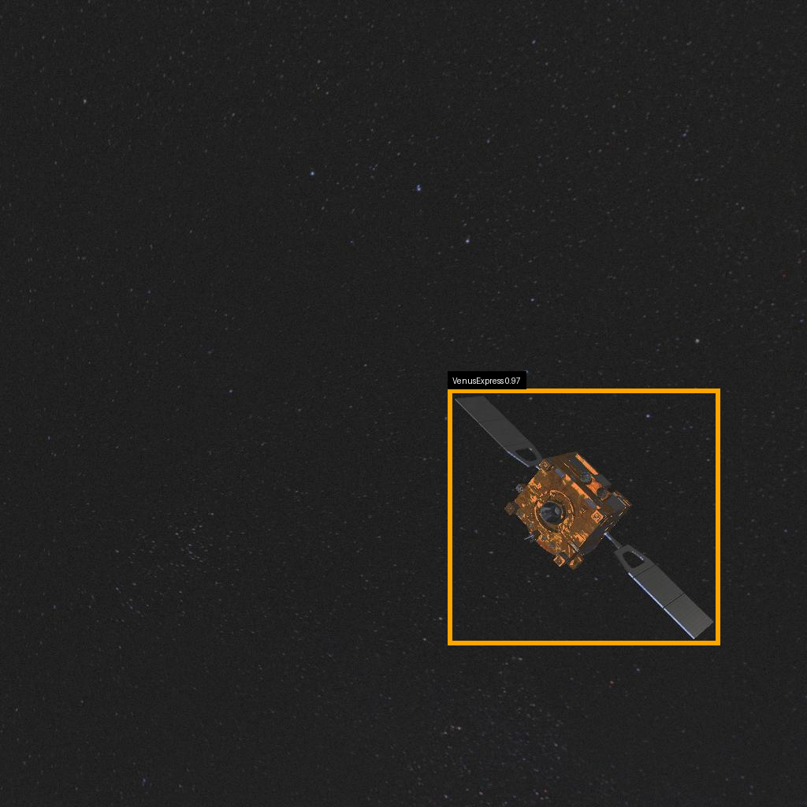

# SPARK 2025 – Spacecraft Detection & Segmentation (CVIA Course Project)

This repository contains my end-to-end pipeline for **spacecraft detection** and **spacecraft part segmentation**, developed for the **CVIA (Computer Vision and Image Analysis)** course / **SPARK challenge** at the University of Luxembourg.

The project is designed to run on **ULHPC with SLURM**, and to produce **Codabench-ready submissions** for:
- **Detection** (multi-class bounding boxes)
- **Segmentation** (spacecraft body + solar panels)

---

## Results (Codabench)

These are the best scores I obtained on the official Codabench evaluation:
- **Detection (RT-DETRv2): 0.9865**
- **Segmentation (DeepLabV3+): 0.88**

---

## Repository Structure

A Level-3 tree of the repository is provided here:
- `PROJECT_TREE_L3.txt`

Main folders:
- `scripts/` – conversion, inference, visualization utilities  
- `models/` – model code and weights (segmentation weights tracked with Git LFS)  
- `jobs/` – SLURM job scripts for ULHPC  
- `logs/` – cleaned SLURM outputs (`logs/**/slurm/*.out`)  
- `inference_results/` – predictions, visualizations, and Codabench submissions  

---

## What is tracked vs local-only

### Tracked in GitHub
- Code (`scripts/`, `models/`, `jobs/`)
- Submission artifacts under `inference_results/` (e.g., `submission_*.zip`, prediction CSV/JSON)
- Segmentation weights (Git LFS):
  - `models/segmentation/deeplabv3plus_baseline/best.pth`
  - `models/segmentation/deeplabv3plus_baseline/last.pth`
- SLURM logs (cleaned): `logs/**/slurm/*.out`

### Not tracked (must exist locally)
- `data/` (datasets)
- training checkpoints under `checkpoints/` (optional local output)
- `wandb/` experiment runs (optional local tracking)
- `_TRASH_DO_NOT_DELETE_YET/` (temporary local folder; not committed)

---

## Models

### Detection
- Model: **RT-DETRv2**
- Location: `models/detection/rtdetrv2/`
- Utilities: `scripts/detection/`
- Outputs: `inference_results/detection/`

### Detection examples (RT-DETRv2)


| Proba-2 | Smart-1 | Venus Express |
|--------|---------|---------------|
|  |  |  |


---

### Segmentation
- Model: **DeepLabV3+ baseline**
- Location: `models/segmentation/deeplabv3plus_baseline/`
- Weights:
  - `best.pth` (Git LFS)
  - `last.pth` (Git LFS)
- Utilities: `scripts/segmentation/`
- Outputs: `inference_results/segmentation/`

### Segmentation examples (DeepLabV3+)

| Example 1 | Example 2 |
|----------|-----------|
|  |  |

**Red:** spacecraft body &nbsp;&nbsp; **Blue:** solar panels

---

## Dataset Layout (local)

Datasets are **not pushed to GitHub**. The expected local layout is:

```text
data/
├── annotations/
│   ├── spark_train.json
│   └── spark_val.json
├── spark-2024-train-val/
│   ├── images/
│   ├── mask/
│   ├── train.csv
│   └── val.csv
├── spark-2024-detection-test/
│   └── images/
└── spark-2024-segmentation-test/
    └── stream-1-test/


### Detection examples (RT-DETRv2)

**Proba-2 spacecraft**


**Smart-1 spacecraft**


**Venus Express spacecraft**


---

### Segmentation examples (DeepLabV3+)

**Spacecraft body (red) and solar panels (blue)**


