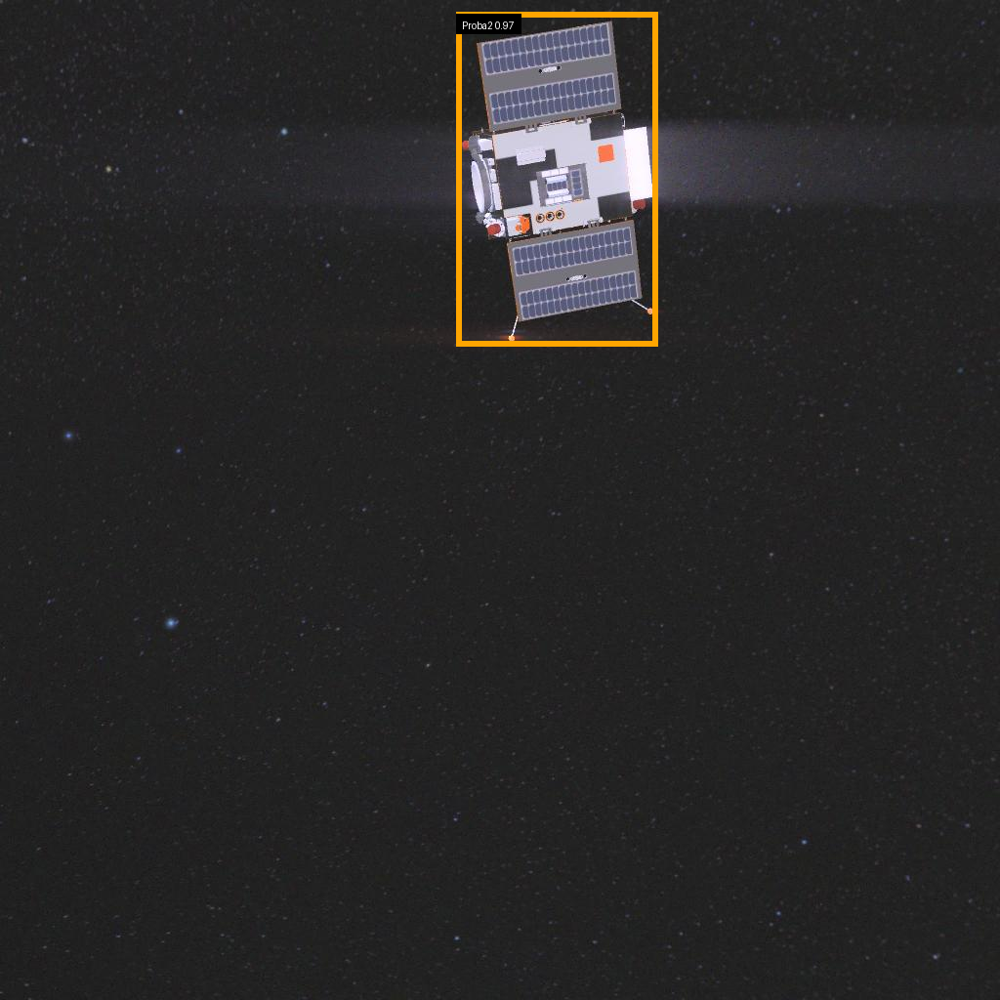
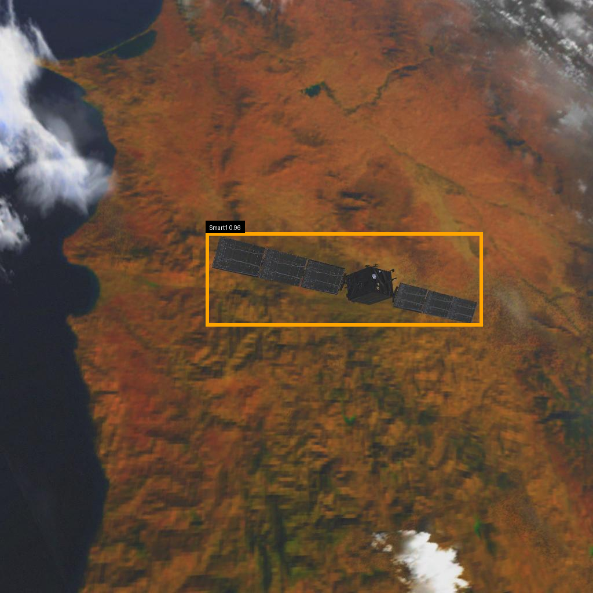
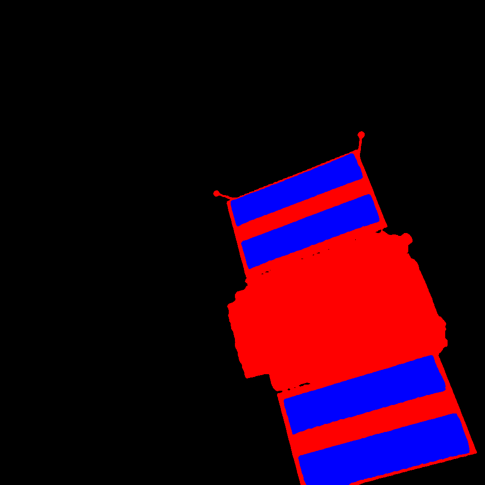
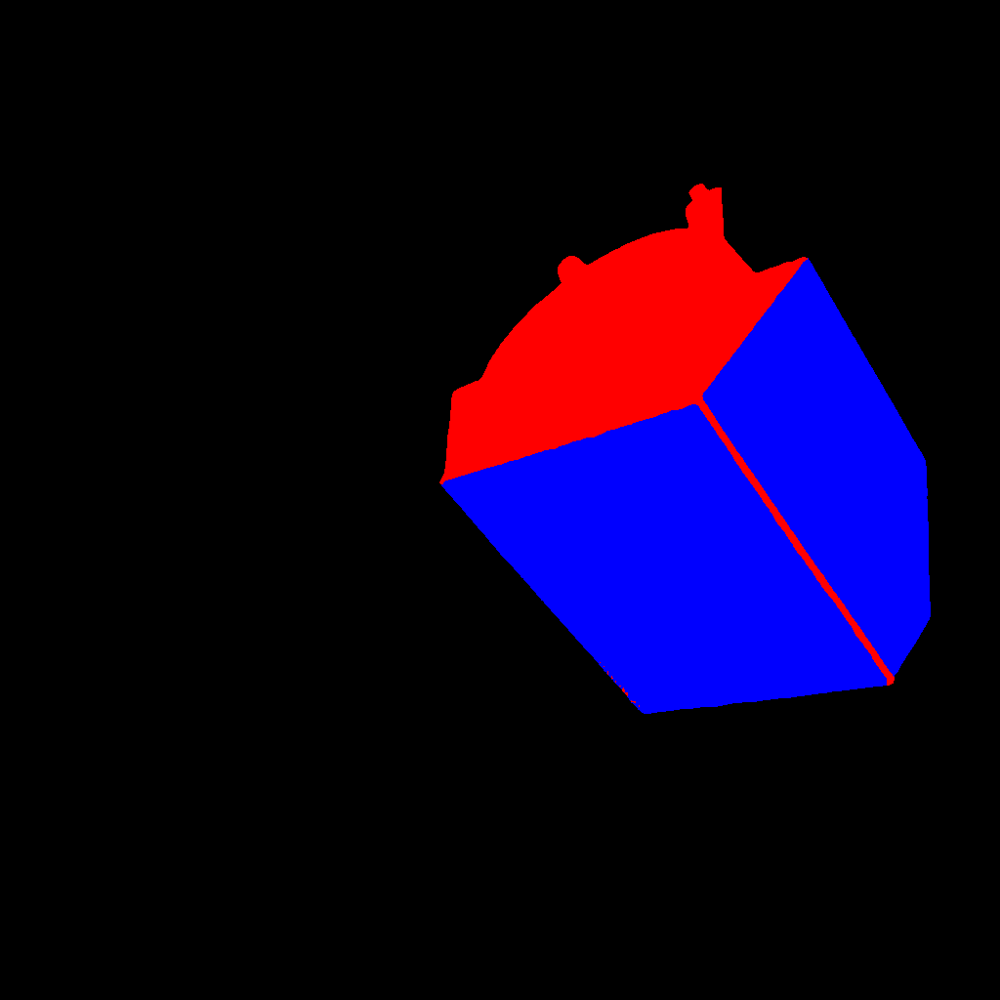

# SPARK 2024: Spacecraft Detection and Segmentation

This repository holds our course project for **Computer Vision and Image Analysis (CVIA)** at the University of Luxembourg. It was built around the SPARK 2024 challenge, which asks two questions about images of spacecraft rendered in simulated orbital conditions: *which spacecraft is in the image and where is it*, and *which pixels belong to the spacecraft body and its solar panels*.

We answer the first with an object detector (RT-DETRv2) and the second with a semantic segmentation network (DeepLabV3+). Everything was trained on the university HPC cluster (ULHPC) using SLURM, and both tasks were submitted to the Codabench leaderboard.

## Team

Group **Delta25**.

| Member | Student ID |
|--------|:----------:|
| Mo Nafees | 0242805924 |
| Nabeel Ahsan | 0240764054 |
| Arooba Arshad | 023063191F |

## Course and Supervision

| | |
|--|--|
| Course | Computer Vision and Image Analysis (CVIA), Fall 2025 |
| Programme | Master in Information and Computer Sciences (MICS) |
| Institution | University of Luxembourg, SnT (Interdisciplinary Centre for Security, Reliability and Trust) |
| Research group | Computer Vision, Imaging and Machine Intelligence (CVI2) |
| Course instructor | Prof. Djamila Aouada |
| Lecturers and project mentors | Anis Kacem, Abdelrahman Shabayek, Dimitris Mallis, Arunkumar Rathinam |

The challenge itself was organised by the CVI2 group. The dataset is generated on top of the Unity3D game engine and models an Earth background, a target spacecraft, a chaser spacecraft, and a camera.

## The Two Tasks

**Detection.** Classify and localise each spacecraft with a bounding box. There are 10 mission classes: Cheops, LisaPathfinder, ObservationSat1, Proba2, Proba3, Proba3ocs, Smart1, Soho, VenusExpress, and XMM Newton.

**Segmentation.** Assign every pixel to one of three classes. We use the encoding `0 = background`, `1 = spacecraft body`, `2 = solar panels`. Each image contains one or two objects to segment, regardless of which spacecraft it is.

Both tasks share the same workflow: prepare the data, train the model, run inference, and format the output for Codabench.

## Results

Numbers below come from our report and presentation. Detection is measured with COCO style metrics on the validation split; the final scores are the Codabench leaderboard values.

| Task | Model | Codabench score | Val AP@0.50 | Val mAP@[0.50:0.95] |
|------|-------|:---------------:|:-----------:|:-------------------:|
| Detection | RT-DETRv2 (ResNet-50vd) | **0.9865** | 0.997 | 0.969 |
| Segmentation | DeepLabV3+ (ResNet-50) | **0.8711** | see notes | see notes |

Detection is strong and stable across every class. Segmentation captures the spacecraft outline well but struggles on the thin solar panels, which is expected given the severe pixel imbalance. More detail is in the sections further down.

## Visual Examples

Detection predictions (bounding box plus class label):

| Proba2 | Smart1 | VenusExpress |
|--------|--------|--------------|
|  |  |  |

Segmentation predictions (red is the spacecraft body, blue is the solar panels):

| Example 1 | Example 2 |
|-----------|-----------|
|  |  |

## Methodology and Architecture

### Detection: RT-DETRv2

RT-DETRv2 is an end to end transformer detector that outputs a fixed set of object queries, each with a class probability and a bounding box in `(cx, cy, w, h)` normalised form. It does not need non maximum suppression. Our configuration stays close to the original implementation so that runs are reproducible and easy to control from YAML.

| Component | Choice |
|-----------|--------|
| Backbone | PResNet-50 variant D, ImageNet pretrained |
| Encoder | HybridEncoder (hidden dim 256, GELU, 1 encoder layer) |
| Decoder | RTDETRTransformerv2 (6 layers, 300 queries, 3 feature levels) |
| Loss | VariFocal, GIoU and L1 with weights 1 : 2 : 5 |
| Optimizer | AdamW, backbone LR 1e-5, other parameters LR 1e-4, weight decay 1e-4 |
| LR schedule | MultiStepLR, decay by 0.1 at epochs 28 and 36 |
| Input size | 640 by 640 |
| Training | 40 epochs, mixed precision (AMP), batch size 8 |
| Augmentation | PhotometricDistort, ZoomOut, IoUCrop, horizontal flip, multi scale resize 480 to 640 px for the first 30 epochs, then plain resize only |

Annotations are converted from the SPARK CSV format into COCO JSON before training (`scripts/detection/convert_spark_to_coco.py`). Separate learning rates are used for the backbone and the detection head because they converge differently. The checkpoint with the best validation AP is kept for inference. Training was tracked with Weights and Biases.

At inference we keep detections above a confidence threshold of 0.30. This threshold was chosen from a sweep on the validation set (see the analysis section).

### Segmentation: DeepLabV3+

DeepLabV3+ predicts a class distribution for every pixel and produces the final mask by taking the argmax over classes. The backbone is ResNet-50, and the Atrous Spatial Pyramid Pooling (ASPP) module gathers context at several scales using dilated convolutions, which helps separate the body from the panels.

| Component | Choice |
|-----------|--------|
| Architecture | DeepLabV3+ (via `segmentation_models_pytorch`) |
| Backbone | ResNet-50 |
| Classes | 3 (background, body, panels) |
| Loss | multi class pixel wise cross entropy |
| Optimizer | AdamW |
| Training | 100 epochs, batch size 8, GPU |
| Test time augmentation | horizontal flip, averaging the logits of the original and flipped image |
| Output | per image PNG masks, then converted to `.npz` and zipped for Codabench |

The ground truth RGB masks are converted to integer label masks (0, 1, 2) before training. The same encoding is used everywhere: training, inference, and evaluation.

## Dataset

Ten spacecraft categories, 10,000 images each. The splits reported in our project are:

| Task | Train | Validation | Test |
|------|:-----:|:----------:|:----:|
| Detection | 60,000 | 20,000 | 20,000 |
| Segmentation | 60,000 | 20,000 | 4,000 |

The test images are unlabelled and are only used for the Codabench submission.

Expected directory layout:

```
data/
├── spark-2024-train-val/
│   ├── images/
│   │   └── <ClassName>/<split>/<image_XXXXX_img.jpg>
│   ├── mask/                     # segmentation ground truth
│   ├── train.csv                 # detection labels
│   └── val.csv
├── spark-2024-detection-test/
│   └── images/
├── spark-2024-segmentation-test/
│   └── stream-1-test/
└── annotations/                  # COCO JSON, generated by our script
    ├── spark_train.json
    └── spark_val.json
```

## Repository Structure

```
spark_project/
├── assets/                # Images used in this README
├── checkpoints/           # Saved model weights (not tracked in git)
├── data/                  # Dataset root (not tracked in git)
├── inference_results/     # Model outputs (not tracked in git)
├── jobs/                  # SLURM job scripts
│   ├── detection/
│   └── segmentation/
├── models/
│   ├── detection/rtdetrv2/        # RT-DETRv2 codebase and YAML configs
│   └── segmentation/
│       └── model_factory.py       # DeepLabV3+ build and checkpoint loader
├── reports/               # Evaluation scripts and generated figures/tables
├── run/                   # Wrappers that pass parameters to the pipeline stages
├── scripts/
│   ├── detection/         # CSV to COCO, dataset loader, submission, visualisation
│   └── segmentation/      # inference, PNG to NPZ submission, visualisation
└── wandb/                 # Weights and Biases run logs (not tracked in git)
```

## Setup

Detection and segmentation have conflicting dependencies, so we use two conda environments.

Detection environment:

```bash
conda create -n spark_rtdetr python=3.10 -y
conda activate spark_rtdetr
pip install -r models/detection/rtdetrv2/requirements.txt
```

Segmentation environment:

```bash
conda create -n spark_seg python=3.10 -y
conda activate spark_seg
pip install torch torchvision segmentation-models-pytorch numpy pillow tqdm
```

## Reproducing the Pipeline

All jobs are submitted to ULHPC with SLURM. To run locally, replace `sbatch` with `bash` or call the Python scripts directly.

**1. Prepare detection annotations (run once)**

```bash
conda activate spark_rtdetr
python scripts/detection/convert_spark_to_coco.py
# writes data/annotations/spark_train.json and spark_val.json
```

**2. Train the detection model**

```bash
sbatch jobs/detection/train_detection_rtdetrv2_gpu.sh
# saves checkpoints/detection/detection_model/best.pth
```

Manual equivalent:

```bash
conda activate spark_rtdetr
export PYTHONPATH="$PWD/models/detection/rtdetrv2:$PYTHONPATH"
python -u models/detection/rtdetrv2/tools/train.py \
  -c models/detection/rtdetrv2/configs/rtdetrv2/rtdetrv2_r50vd_spark_40ep.yml \
  --device cuda --use-amp \
  --output-dir checkpoints/detection/detection_model
```

**3. Train the segmentation model**

```bash
sbatch jobs/segmentation/infer_segmentation_train.sh
# saves checkpoints/segmentation/segmentation_model/best.pth
```

**4. Detection inference and submission**

```bash
sbatch jobs/detection/infer_detection_test_gpu.sh
# writes inference_results/detection/detection_test_predictions.json

conda activate spark_rtdetr
python scripts/detection/convert_predictions_to_submission.py
# writes inference_results/detection/detection.csv
```

**5. Segmentation inference and submission**

```bash
sbatch jobs/segmentation/infer_segmentation_test_gpu.sh
# writes inference_results/segmentation/predicted_masks/*.png

sbatch jobs/segmentation/build_segmentation_submission_cpu.sh
# writes inference_results/segmentation/final/submission_segmentation.zip
```

## Detailed Results

### Detection, validation COCO metrics

| Metric | Value |
|--------|:-----:|
| AP@0.50 | 0.997 |
| AP@0.75 | 0.994 |
| mAP@[0.50:0.95] | 0.969 |
| AR@100 | 0.978 |

Performance on large objects is excellent (AP 0.970). Medium objects are harder (AP 0.736), which reflects the scale variation in the dataset. Metrics for small objects were not available because the dataset has almost no small instances.

### Detection, per class AP@[0.50:0.95] (validation)

| Class | AP |
|-------|:--:|
| Proba2 | 0.9861 |
| Cheops | 0.9838 |
| ObservationSat1 | 0.9813 |
| LisaPathfinder | 0.9810 |
| Proba3 | 0.9801 |
| XMM Newton | 0.9743 |
| Proba3ocs | 0.9619 |
| VenusExpress | 0.9559 |
| Soho | 0.9529 |
| Smart1 | 0.9360 |

Every class scores above 0.93. Smart1 is the weakest, mostly because of intra class variation and visual similarity to other spacecraft. No class collapses, which shows balanced generalisation.

### Detection, confidence threshold analysis

The detection count stays stable for thresholds from 0.05 to 0.40 and only drops slightly above 0.40, which tells us the confidence scores are well calibrated. At the chosen operating point of 0.30, the model produces about 5,002 detections over 5,000 images, matching the dataset expectation of roughly one detection per image. The mean confidence of the kept detections is about 0.97.

### Segmentation, pixel imbalance (validation)

| Class | Pixels (millions) | Percentage |
|-------|:-----------------:|:----------:|
| Background | 1996.24 | 95.21% |
| Body | 75.90 | 3.62% |
| Panels | 25.01 | 1.19% |
| Total | 2097.15 | 100.00% |

The background dominates the image. The solar panels are only about 1.2% of all pixels, so even a small number of misclassified pixels moves their IoU a lot.

### Segmentation, validation IoU

| Class | IoU |
|-------|:---:|
| Background | 0.967 |
| Body | 0.003 |
| Panels | 0.009 |
| mIoU | 0.326 |

The foreground IoU is low, which is consistent with pixel perfect segmentation being very hard on thin, rare structures. This is why we also looked at the predictions visually. The overlays show that the spacecraft silhouette and main body are captured well, with the panels remaining the hardest region.

The Codabench score of 0.8711 is higher than the local mIoU because the leaderboard evaluates the held out test split with its own metric that focuses on the foreground classes. The main lesson for us was that for thin, rare classes the numbers alone can be misleading, so quantitative scores should be read together with qualitative inspection.

## Infrastructure

Training and inference ran on the ULHPC cluster (Nvidia V100 GPUs) managed by SLURM. The pipeline is PyTorch based, with separate environments for detection and segmentation. Runs were tracked with Weights and Biases.

## Acknowledgements

* RT-DETRv2 implementation by [lyuwenyu](https://github.com/lyuwenyu/RT-DETR), adapted with our own SPARK training configuration.
* DeepLabV3+ through the [`segmentation_models_pytorch`](https://github.com/qubvel/segmentation_models.pytorch) library.
* SPARK 2024 challenge organised by the CVI2 group at the University of Luxembourg.

```bibtex
@misc{lv2024rtdetrv2improvedbaselinebagoffreebies,
  title   = {RT-DETRv2: Improved Baseline with Bag-of-Freebies for Real-Time Detection Transformer},
  author  = {Wenyu Lv and Yian Zhao and Qinyao Chang and Kui Huang and Guanzhong Wang and Yi Liu},
  year    = {2024},
  eprint  = {2407.17140},
  archivePrefix = {arXiv},
  primaryClass  = {cs.CV},
  url     = {https://arxiv.org/abs/2407.17140}
}
```
